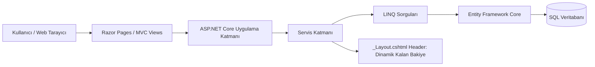
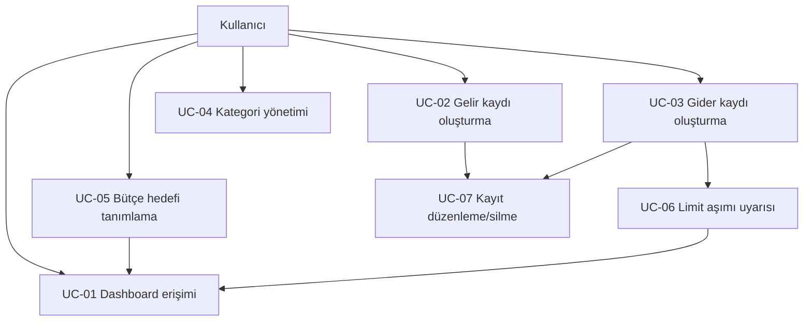

# Software Requirements Specification

## Kişisel Finans ve Bütçe Takip Sistemi (Bütçe Takip Sistemi)

| **Alan**     | **Bilgi**                                                                  |
|--------------|----------------------------------------------------------------------------|
| Sürüm        | 1.0                                                                        |
| Tarih        | 08 Haziran 2026                                                            |
| Teknoloji    | ASP.NET Core, C#, Razor Pages/MVC Razor Views, LINQ, Entity Framework Core |
| Hazırlayan   | Yusuf İpek                                                                 |
| Doküman Türü | Yazılım Gereksinim Belirtimi (SRS)                                         |

*Bu doküman, Bütçe Takip Sistemi adlı kişisel finans ve bütçe takip sisteminin kapsamını, işlevsel gereksinimlerini, kullanım senaryolarını, arayüz beklentilerini ve işlevsel olmayan gereksinimlerini tanımlar. Markdown sürümünde şekiller taşınabilirlik için Mermaid diyagramı olarak verilmiştir.*

# Revizyon Geçmişi

| **Sürüm** | **Tarih**  | **Açıklama**                  | **Yazar**  |
|-----------|------------|-------------------------------|------------|
| 1.0       | 08.06.2026 | İlk SRS dokümanı oluşturuldu. | Yusuf İpek |

# Table of Contents

- 1.0. Purpose

- 1.1. Introduction

- 1.2. Scope

- 1.3. Glossary

- 1.4. References

- 1.5. Document overview

- 2.0. Overall description

- 2.1. System environment

- 2.2. Functional requirements definitions

- 2.3. User profile and assumptions

- 2.4. Use cases

- 2.5. Non-functional requirements

- 3.0. Requirement specifications

- 3.1. External interface specifications

- 3.2. Functional requirements

- 3.3. Detailed non-functional requirements

- 3.4. System evolution

- 4.0. Index

# Table of Figures

- Figure 1 Bütçe Takip Sistemi System Environment

- Figure 2 Bütçe Takip Sistemi Use Case Overview

# 1.0. Purpose

## 1.1. Introduction

Bu Software Requirements Specification (SRS) dokümanı, Bütçe Takip Sistemi kişisel finans ve bütçe takip sisteminin yazılım gereksinimlerini açıklar. Doküman; gelir ve gider kayıtlarının kategori bazlı girilmesi, aylık özetlerin dashboard üzerinden görüntülenmesi, bütçe hedeflerinin belirlenmesi, limit aşımında uyarı verilmesi ve kalan bakiyenin uygulama genelinde dinamik olarak gösterilmesi işlevlerini tanımlar.

Beklenen okuyucu kitlesi; proje geliştiricisi, ders sorumlusu, test sürecini yürütecek kişiler ve sistemin bakımını üstlenecek yazılım geliştiricileridir. Doküman aynı zamanda .NET ve Razor tabanlı uygulama geliştirme sırasında referans alınacak ana gereksinim kaynağıdır.

## 1.2. Scope

Bütçe Takip Sistemi; kullanıcının gelir ve gider hareketlerini kayıt altına aldığı, harcamalarını kategori bazında takip ettiği ve aylık bütçe limitleri üzerinden uyarı aldığı web tabanlı bir kişisel finans uygulamasıdır. Sistem, ASP.NET Core üzerinde Razor Pages veya MVC Razor Views yapısı ile geliştirilecek, C# dili kullanılacak ve veri sorgulama/özetleme işlemlerinde LINQ tabanlı agregasyonlar kullanılacaktır.

- **Kullanıcı:** Gelir ve gider kalemlerini kategori bazlı olarak sisteme girer.

- **Dashboard:** Aylık toplam gelir, gider, net bakiye ve kategori dağılımı gibi özetleri görüntüler.

- **Bütçe hedefi:** Belirli bir kategori için aylık limit tanımlar ve limit aşımında sistemden uyarı alır.

- **Teknik kapsam:** Razor syntax, client-side validation, LINQ GroupBy/Sum sorguları ve ortak layout üzerinden dinamik bakiye gösterimi içerir.

Bu sürümde sistem tek kullanıcı odaklı bir ders/proje uygulaması olarak ele alınmıştır. Kimlik doğrulama, banka entegrasyonu, gerçek zamanlı kart hareketi çekme ve çok kullanıcılı abonelik yönetimi bu SRS kapsamına dahil değildir; ancak sistem evrimi bölümünde gelecekteki genişletme alanları olarak belirtilmiştir.

## 1.3. Glossary

| **Terim**              | **Tanım**                                                                                             |
|------------------------|-------------------------------------------------------------------------------------------------------|
| Bütçe Takip Sistemi              | Kişisel finans ve bütçe takip sistemi.                                                                |
| Gelir                  | Maaş, burs, freelance ödeme, satış geliri gibi kullanıcıya para girişi sağlayan kayıt.                |
| Gider                  | Market, kira, ulaşım, eğlence gibi kullanıcıdan para çıkışı sağlayan kayıt.                           |
| Kategori               | Gelir veya gider kayıtlarını sınıflandıran başlık. Örn: Market, Kira, Maaş, Eğlence.                  |
| Bütçe Hedefi           | Belirli kategori için aylık üst harcama limiti.                                                       |
| Dashboard              | Aylık finansal özetlerin grafik, tablo ve kartlar üzerinden gösterildiği ana panel.                   |
| Kalan Bakiye           | Toplam gelirden toplam giderin çıkarılmasıyla elde edilen net değer.                                  |
| Razor                  | ASP.NET Core içinde C# kodu ile HTML üretimini birleştiren .cshtml tabanlı şablonlama yapısı.         |
| LINQ                   | C# üzerinde koleksiyon veya veri kaynağı sorgulamak için kullanılan Language Integrated Query yapısı. |
| Client-side Validation | Tarayıcı tarafında, form gönderilmeden önce yapılan kullanıcı girdisi kontrolü.                       |
| EF Core                | Entity Framework Core; .NET uygulamalarında veritabanı erişimi için kullanılan ORM katmanı.           |

## 1.4. References

- \[IEEE\] IEEE Software Requirements Specification yaklaşımı ve SRS doküman şablonu.

- \[ASP.NET Core\] Microsoft ASP.NET Core Razor Pages / MVC Razor Views dokümantasyonu.

- \[Project Brief\] Bütçe Takip Sistemi proje açıklaması: gelir/gider girişi, dashboard, bütçe hedefi, LINQ agregasyonları, client-side validation ve layout üzerinde bakiye gösterimi.

- \[SRSSample\] Web Accessible Alumni Database SRS örneği; bölüm yapısı, use case sunumu ve gereksinim tablosu düzeni için referans alınmıştır.

## 1.5. Document overview

Dokümanın ikinci bölümü sistemin genel yapısını, sistem ortamını, kullanıcı varsayımlarını ve use case özetlerini açıklar. Üçüncü bölüm her fonksiyonel gereksinimi ayrıntılı olarak tanımlar; tetikleyici, ön koşul, temel akış, alternatif akış ve hata durumlarını listeler. Son bölüm sistem evrimi ve indeks bilgilerini içerir.

# 2.0. Overall description

Bütçe Takip Sistemi tamamen web tabanlı bir uygulama olarak tasarlanmıştır. Kullanıcı standart bir web tarayıcı üzerinden sisteme erişir. Razor arayüzleri kullanıcıdan gelir, gider, kategori ve bütçe hedefi bilgilerini alır. Sunucu tarafında ASP.NET Core controller/page model katmanı gelen veriyi doğrular, Entity Framework Core aracılığıyla kalıcı veri katmanına yazar ve dashboard için LINQ sorguları ile aylık toplamları üretir.

## 2.1. System environment

Sistem ortamı; istemci tarayıcı, ASP.NET Core uygulama katmanı, LINQ/EF Core veri erişim katmanı ve SQL tabanlı veritabanından oluşur. Ortak \_Layout.cshtml dosyası, her sayfada güncel kalan bakiye değerini göstermekle sorumludur.

*Figure 1 Bütçe Takip Sistemi System Environment*

Kullanıcı bir işlem formu gönderdiğinde, sistem önce client-side validation kurallarını uygular. Form geçerli ise sunucu tarafı doğrulama çalışır. Geçerli kayıtlar veri tabanına eklenir; dashboard sayfası ise aylık filtreleme, kategori bazlı gruplama ve toplam alma işlemlerini LINQ sorguları ile üretir.

## 2.2. Functional requirements definitions

İşlevsel gereksinimler, sistemin kullanıcıya hangi hizmetleri sunacağını belirler. Bütçe Takip Sistemi için temel işlevler; gelir/gider kaydı, kategori yönetimi, dashboard görüntüleme, bütçe hedefi belirleme, limit aşımı uyarısı ve kayıt düzenleme/silme işlemleridir.

İşlevsel olmayan gereksinimler ise performans, güvenlik, doğrulama, kullanılabilirlik, bakım kolaylığı, tarayıcı uyumluluğu ve kod standartları gibi sistemin nasıl çalışması gerektiğini tanımlar.

## 2.3. User profile and assumptions

- Birincil kullanıcı, kişisel finans hareketlerini manuel olarak takip etmek isteyen bireysel kullanıcıdır.

- Kullanıcı gelir ve gider kayıtlarını kategori bazlı olarak girebilir.

- Kullanıcı aynı ay içinde bir kategoriye bütçe limiti tanımlayabilir.

- Sistemin bu sürümünde banka API entegrasyonu veya otomatik kart hareketi çekme bulunmaz.

- Girdi doğrulama hem tarayıcı tarafında hem sunucu tarafında yapılır.

- Tutar alanları sıfırdan büyük olmalıdır; negatif harcama veya negatif gelir kaydı kabul edilmez.

- Net bakiye, giderlerin gelirlerden fazla olması durumunda negatif görünebilir; bu durum veri hatası değil finansal uyarı durumudur.

## 2.4. Use cases

Sistem, kullanıcının ana sayfaya erişmesi, gelir/gider eklemesi, kategori yönetmesi, bütçe hedefi tanımlaması, aylık özetleri görüntülemesi ve kayıtları güncellemesi üzerine kuruludur.

*Figure 2 Bütçe Takip Sistemi Use Case Overview*

| **Use Case** | **Ad**                 | **Kısa Açıklama**                                                                  |
|--------------|------------------------|------------------------------------------------------------------------------------|
| UC-01        | Dashboard erişimi      | Kullanıcı ana sayfada aylık gelir, gider ve kalan bakiye özetini görür.            |
| UC-02        | Gelir kaydı oluşturma  | Kullanıcı kategori, açıklama, tarih ve tutar bilgisiyle gelir kaydı ekler.         |
| UC-03        | Gider kaydı oluşturma  | Kullanıcı kategori, açıklama, tarih ve tutar bilgisiyle gider kaydı ekler.         |
| UC-04        | Kategori yönetimi      | Kullanıcı gelir/gider kategorilerini listeler, ekler, düzenler veya pasifleştirir. |
| UC-05        | Bütçe hedefi tanımlama | Kullanıcı kategori bazlı aylık limit belirler.                                     |
| UC-06        | Limit aşımı uyarısı    | Sistem kategori harcaması limiti geçtiğinde kullanıcıyı uyarır.                    |
| UC-07        | Kayıt düzenleme/silme  | Kullanıcı hatalı veya eski gelir/gider kayıtlarını günceller ya da siler.          |

## 2.5. Non-functional requirements

- **Kullanılabilirlik:** Formlar anlaşılır etiketler, hata mesajları ve doğrulama geri bildirimleri içermelidir.

- **Performans:** Dashboard agregasyon sorguları tipik veri büyüklüklerinde makul sürede tamamlanmalıdır.

- **Güvenlik:** Kullanıcı girdileri sunucu tarafında doğrulanmalı; model binding ve anti-forgery token mekanizmaları kullanılmalıdır.

- **Bakım kolaylığı:** Razor view dosyaları, PageModel/Controller sınıfları, ViewModel yapıları ve servis katmanı ayrıştırılmış olmalıdır.

- **Uyumluluk:** Uygulama güncel Chrome, Edge ve Firefox tarayıcılarında çalışmalıdır.

# 3.0. Requirement specifications

## 3.1. External interface specifications

Bu bölüm Bütçe Takip Sistemi sisteminin kullanıcı arayüzü, yazılım arayüzleri ve veri arayüzlerini tanımlar.

- **Kullanıcı arayüzü:** Razor tabanlı .cshtml sayfaları; dashboard, gelir/gider formu, kategori yönetimi ve bütçe hedefi sayfalarını içerir.

- **Yazılım arayüzü:** ASP.NET Core routing, model binding, DataAnnotations, ViewModel yapıları, Razor tag helper bileşenleri ve EF Core DbContext kullanılır.

- **Veri arayüzü:** Transaction, Category ve BudgetGoal varlıkları üzerinden veritabanı işlemleri yürütülür.

- **Doğrulama arayüzü:** Client-side validation için jQuery Validation / Unobtrusive Validation veya ASP.NET Core Validation Tag Helpers kullanılabilir.

| **ID** | **Arayüz**             | **Açıklama**                                                                             |
|--------|------------------------|------------------------------------------------------------------------------------------|
| EI-01  | Dashboard              | Aylık gelir, gider, net bakiye, kategori harcama dağılımı ve bütçe uyarılarını gösterir. |
| EI-02  | Gelir/Gider Formu      | Kategori, işlem tipi, tutar, tarih ve açıklama alanlarını içerir.                        |
| EI-03  | Kategori Formu         | Kategori adı ve kategori türü bilgilerini alır.                                          |
| EI-04  | Bütçe Hedefi Formu     | Kategori, ay, yıl ve limit tutarı bilgilerini alır.                                      |
| EI-05  | \_Layout.cshtml Header | Her sayfada güncel kalan bakiye bilgisini dinamik olarak gösterir.                       |

## 3.2. Functional Requirements

| **ID** | **Gereksinim**          | **Öncelik** | **Açıklama**                                                                             |
|--------|-------------------------|-------------|------------------------------------------------------------------------------------------|
| FR-01  | Dashboard görüntüleme   | Essential   | Kullanıcı aylık gelir/gider özetini ve net bakiyeyi görüntüleyebilmelidir.               |
| FR-02  | Gelir kaydı ekleme      | Essential   | Kullanıcı pozitif tutarlı gelir kaydı ekleyebilmelidir.                                  |
| FR-03  | Gider kaydı ekleme      | Essential   | Kullanıcı pozitif tutarlı gider kaydı ekleyebilmelidir.                                  |
| FR-04  | Kategori yönetimi       | Essential   | Kullanıcı gelir ve gider kategorilerini yönetebilmelidir.                                |
| FR-05  | Bütçe hedefi tanımlama  | Essential   | Kullanıcı kategori bazlı aylık limit belirleyebilmelidir.                                |
| FR-06  | Limit aşımı uyarısı     | Essential   | Sistem limit aşımı veya limite yaklaşma durumunda uyarı vermelidir.                      |
| FR-07  | LINQ agregasyonları     | Essential   | Sistem aylık toplamları GroupBy, Sum, Where gibi LINQ sorguları ile hesaplamalıdır.      |
| FR-08  | Header bakiye gösterimi | Essential   | Sistem kalan bakiyeyi ortak layout üzerinde her sayfada göstermelidir.                   |
| FR-09  | Kayıt düzenleme/silme   | Important   | Kullanıcı hatalı gelir/gider kayıtlarını değiştirebilmeli veya silebilmelidir.           |
| FR-10  | Form doğrulama          | Essential   | Tutar alanları negatif veya sıfır kabul etmemeli; zorunlu alanlar boş bırakılamamalıdır. |

### 3.2.1. Access Dashboard Home Page

<table>
<colgroup>
<col style="width: 50%" />
<col style="width: 50%" />
</colgroup>
<thead>
<tr class="header">
<th><strong>Alan</strong></th>
<th><strong>Açıklama</strong></th>
</tr>
</thead>
<tbody>
<tr class="odd">
<td><strong>Use Case Name</strong></td>
<td>Access Dashboard Home Page</td>
</tr>
<tr class="even">
<td><strong>Priority</strong></td>
<td>Essential</td>
</tr>
<tr class="odd">
<td><strong>Trigger</strong></td>
<td>Menü seçimi veya uygulama kök adresine erişim</td>
</tr>
<tr class="even">
<td><strong>Precondition</strong></td>
<td>Kullanıcı web tarayıcı üzerinden uygulamaya erişebilir durumdadır.</td>
</tr>
<tr class="odd">
<td><strong>Basic Path</strong></td>
<td>1. Kullanıcı Bütçe Takip Sistemi ana sayfasını açar. 
2. Razor sayfası dashboard ViewModel verisini ister. 
3. Sistem seçili ay için toplam gelir, toplam gider ve net bakiyeyi LINQ sorguları ile hesaplar. 
4. Sistem dashboard kartlarını, grafik/özet alanlarını ve bütçe uyarılarını gösterir. 
5. _Layout.cshtml header alanında güncel kalan bakiye gösterilir.</td>
</tr>
<tr class="even">
<td><strong>Alternate Path</strong></td>
<td>Kullanıcı ay/yıl filtresini değiştirirse sistem ilgili dönem için hesaplamaları yeniden üretir.</td>
</tr>
<tr class="odd">
<td><strong>Postcondition</strong></td>
<td>Kullanıcı dashboard üzerinde aylık finansal özetini görür.</td>
</tr>
<tr class="even">
<td><strong>Exception Path</strong></td>
<td>Veri tabanı bağlantısı başarısız olursa sistem kullanıcıya anlaşılır hata mesajı gösterir ve sayfa güvenli şekilde sonlandırılır.</td>
</tr>
<tr class="odd">
<td><strong>Reference</strong></td>
<td>SRS 2.4 / FR-01 / FR-07 / FR-08</td>
</tr>
</tbody>
</table>

### 3.2.2. Create Income Entry

<table>
<colgroup>
<col style="width: 50%" />
<col style="width: 50%" />
</colgroup>
<thead>
<tr class="header">
<th><strong>Alan</strong></th>
<th><strong>Açıklama</strong></th>
</tr>
</thead>
<tbody>
<tr class="odd">
<td><strong>Use Case Name</strong></td>
<td>Create Income Entry</td>
</tr>
<tr class="even">
<td><strong>Priority</strong></td>
<td>Essential</td>
</tr>
<tr class="odd">
<td><strong>Trigger</strong></td>
<td>Kullanıcının “Gelir Ekle” formunu göndermesi</td>
</tr>
<tr class="even">
<td><strong>Precondition</strong></td>
<td>En az bir gelir kategorisi tanımlıdır ve kullanıcı form sayfasındadır.</td>
</tr>
<tr class="odd">
<td><strong>Basic Path</strong></td>
<td>1. Kullanıcı gelir ekleme sayfasını açar. 
2. Sistem gelir kategorilerini liste halinde sunar. 
3. Kullanıcı kategori, tutar, tarih ve isteğe bağlı açıklama bilgisini girer. 
4. Client-side validation tutarın sıfırdan büyük olup olmadığını ve zorunlu alanları kontrol eder. 
5. Form geçerliyse sunucu tarafı model validation çalışır. 
6. Sistem Transaction tablosuna Income tipinde yeni kayıt ekler. 
7. Sistem kullanıcıyı dashboard sayfasına yönlendirir ve yeni bakiye değerini gösterir.</td>
</tr>
<tr class="even">
<td><strong>Alternate Path</strong></td>
<td>Kullanıcı “İptal” seçeneğini seçerse form temizlenir ve dashboard sayfasına dönülür.</td>
</tr>
<tr class="odd">
<td><strong>Postcondition</strong></td>
<td>Gelir kaydı veri tabanına eklenir; aylık özet ve header bakiyesi güncellenir.</td>
</tr>
<tr class="even">
<td><strong>Exception Path</strong></td>
<td>Tutar negatif/sıfır ise veya kategori boşsa form yeniden gösterilir ve alan bazlı hata mesajı verilir.</td>
</tr>
<tr class="odd">
<td><strong>Reference</strong></td>
<td>SRS 2.4 / FR-02 / FR-10</td>
</tr>
</tbody>
</table>

### 3.2.3. Create Expense Entry

<table>
<colgroup>
<col style="width: 50%" />
<col style="width: 50%" />
</colgroup>
<thead>
<tr class="header">
<th><strong>Alan</strong></th>
<th><strong>Açıklama</strong></th>
</tr>
</thead>
<tbody>
<tr class="odd">
<td><strong>Use Case Name</strong></td>
<td>Create Expense Entry</td>
</tr>
<tr class="even">
<td><strong>Priority</strong></td>
<td>Essential</td>
</tr>
<tr class="odd">
<td><strong>Trigger</strong></td>
<td>Kullanıcının “Gider Ekle” formunu göndermesi</td>
</tr>
<tr class="even">
<td><strong>Precondition</strong></td>
<td>En az bir gider kategorisi tanımlıdır ve kullanıcı form sayfasındadır.</td>
</tr>
<tr class="odd">
<td><strong>Basic Path</strong></td>
<td>1. Kullanıcı gider ekleme sayfasını açar. 
2. Sistem gider kategorilerini liste halinde sunar. 
3. Kullanıcı kategori, tutar, tarih ve isteğe bağlı açıklama bilgisini girer. 
4. Client-side validation tutarın sıfırdan büyük olduğunu kontrol eder. 
5. Sunucu tarafı doğrulama tekrar çalışır. 
6. Sistem Transaction tablosuna Expense tipinde yeni kayıt ekler. 
7. Sistem ilgili kategori için aylık toplam harcamayı LINQ Sum ile hesaplar. 
8. Harcama kategori limitini aşıyorsa dashboard ve/veya form sonrası uyarı mesajı gösterilir.</td>
</tr>
<tr class="even">
<td><strong>Alternate Path</strong></td>
<td>Kullanıcı kategori limitine yaklaşmışsa sistem uyarı seviyesini “yaklaşıyor” olarak gösterebilir.</td>
</tr>
<tr class="odd">
<td><strong>Postcondition</strong></td>
<td>Gider kaydı veri tabanına eklenir; dashboard özetleri, bütçe durumu ve header bakiyesi güncellenir.</td>
</tr>
<tr class="even">
<td><strong>Exception Path</strong></td>
<td>Form geçersizse veri tabanına kayıt atılmaz; kullanıcı aynı form üzerinde doğrulama mesajlarını görür.</td>
</tr>
<tr class="odd">
<td><strong>Reference</strong></td>
<td>SRS 2.4 / FR-03 / FR-06 / FR-10</td>
</tr>
</tbody>
</table>

### 3.2.4. Manage Categories

<table>
<colgroup>
<col style="width: 50%" />
<col style="width: 50%" />
</colgroup>
<thead>
<tr class="header">
<th><strong>Alan</strong></th>
<th><strong>Açıklama</strong></th>
</tr>
</thead>
<tbody>
<tr class="odd">
<td><strong>Use Case Name</strong></td>
<td>Manage Categories</td>
</tr>
<tr class="even">
<td><strong>Priority</strong></td>
<td>Essential</td>
</tr>
<tr class="odd">
<td><strong>Trigger</strong></td>
<td>Kullanıcının kategori yönetimi sayfasına erişmesi</td>
</tr>
<tr class="even">
<td><strong>Precondition</strong></td>
<td>Kullanıcı uygulama içindedir ve kategori yönetimi sayfasını açmıştır.</td>
</tr>
<tr class="odd">
<td><strong>Basic Path</strong></td>
<td>1. Sistem mevcut kategorileri gelir/gider türüne göre listeler. 
2. Kullanıcı yeni kategori adı ve türünü girer. 
3. Sistem kategori adının boş olmadığını ve aynı türde tekrar etmediğini kontrol eder. 
4. Geçerli kategori veri tabanına kaydedilir. 
5. Kategori formlarda seçilebilir hale gelir.</td>
</tr>
<tr class="even">
<td><strong>Alternate Path</strong></td>
<td>Kullanıcı kullanılmayan kategoriyi silebilir; kullanılmış kategori için silme yerine pasifleştirme önerilir.</td>
</tr>
<tr class="odd">
<td><strong>Postcondition</strong></td>
<td>Kategori listesi güncellenir ve işlem formlarında kullanılabilir hale gelir.</td>
</tr>
<tr class="even">
<td><strong>Exception Path</strong></td>
<td>Aynı adda kategori eklenmeye çalışılırsa sistem hata mesajı gösterir.</td>
</tr>
<tr class="odd">
<td><strong>Reference</strong></td>
<td>SRS 2.4 / FR-04</td>
</tr>
</tbody>
</table>

### 3.2.5. Set Budget Goal

<table>
<colgroup>
<col style="width: 50%" />
<col style="width: 50%" />
</colgroup>
<thead>
<tr class="header">
<th><strong>Alan</strong></th>
<th><strong>Açıklama</strong></th>
</tr>
</thead>
<tbody>
<tr class="odd">
<td><strong>Use Case Name</strong></td>
<td>Set Budget Goal</td>
</tr>
<tr class="even">
<td><strong>Priority</strong></td>
<td>Essential</td>
</tr>
<tr class="odd">
<td><strong>Trigger</strong></td>
<td>Kullanıcının “Bütçe Hedefi” formunu göndermesi</td>
</tr>
<tr class="even">
<td><strong>Precondition</strong></td>
<td>Kullanıcı bütçe hedefi sayfasındadır; en az bir gider kategorisi tanımlıdır.</td>
</tr>
<tr class="odd">
<td><strong>Basic Path</strong></td>
<td>1. Kullanıcı gider kategorisi, ay, yıl ve limit tutarını seçer. 
2. Client-side validation limit tutarının sıfırdan büyük olduğunu kontrol eder. 
3. Sunucu tarafı doğrulama aynı kategori-ay-yıl için tek aktif bütçe hedefi olmasını sağlar. 
4. Sistem BudgetGoal kaydını oluşturur veya mevcut kaydı günceller. 
5. Dashboard ilgili kategori için hedef ve gerçekleşen harcama bilgisini gösterir.</td>
</tr>
<tr class="even">
<td><strong>Alternate Path</strong></td>
<td>Aynı dönem için bütçe varsa sistem güncelleme onayı isteyebilir veya kaydı doğrudan güncelleyebilir.</td>
</tr>
<tr class="odd">
<td><strong>Postcondition</strong></td>
<td>Kategori bazlı aylık bütçe hedefi tanımlanır ve dashboard üzerinde kullanılır.</td>
</tr>
<tr class="even">
<td><strong>Exception Path</strong></td>
<td>Limit negatif/sıfır ise kayıt yapılmaz; kullanıcıya alan bazlı hata mesajı gösterilir.</td>
</tr>
<tr class="odd">
<td><strong>Reference</strong></td>
<td>SRS 2.4 / FR-05 / FR-10</td>
</tr>
</tbody>
</table>

### 3.2.6. View Monthly Dashboard and Aggregates

<table>
<colgroup>
<col style="width: 50%" />
<col style="width: 50%" />
</colgroup>
<thead>
<tr class="header">
<th><strong>Alan</strong></th>
<th><strong>Açıklama</strong></th>
</tr>
</thead>
<tbody>
<tr class="odd">
<td><strong>Use Case Name</strong></td>
<td>View Monthly Dashboard and Aggregates</td>
</tr>
<tr class="even">
<td><strong>Priority</strong></td>
<td>Essential</td>
</tr>
<tr class="odd">
<td><strong>Trigger</strong></td>
<td>Kullanıcının dashboard sayfasına girmesi veya ay filtresini değiştirmesi</td>
</tr>
<tr class="even">
<td><strong>Precondition</strong></td>
<td>Sistemde ilgili ay için sıfır veya daha fazla işlem kaydı bulunabilir.</td>
</tr>
<tr class="odd">
<td><strong>Basic Path</strong></td>
<td>1. Kullanıcı ay/yıl seçer. 
2. Sistem işlemleri seçili dönem için filtreler. 
3. LINQ Where ile dönem filtresi uygulanır. 
4. Gelir ve gider toplamları Sum ile hesaplanır. 
5. Kategori bazlı gider dağılımı GroupBy ve Sum ile hesaplanır. 
6. Sistem dashboard kartları ve grafik/özet alanlarını günceller.</td>
</tr>
<tr class="even">
<td><strong>Alternate Path</strong></td>
<td>İlgili ayda kayıt yoksa sistem sıfır değerli boş durum ekranı gösterir.</td>
</tr>
<tr class="odd">
<td><strong>Postcondition</strong></td>
<td>Kullanıcı seçili ay için doğru finansal özetleri görür.</td>
</tr>
<tr class="even">
<td><strong>Exception Path</strong></td>
<td>Agregasyon sırasında veri erişim hatası oluşursa sistem hatayı loglar ve kullanıcıya genel hata mesajı gösterir.</td>
</tr>
<tr class="odd">
<td><strong>Reference</strong></td>
<td>SRS 2.4 / FR-01 / FR-07</td>
</tr>
</tbody>
</table>

### 3.2.7. Edit or Delete Transaction

<table>
<colgroup>
<col style="width: 50%" />
<col style="width: 50%" />
</colgroup>
<thead>
<tr class="header">
<th><strong>Alan</strong></th>
<th><strong>Açıklama</strong></th>
</tr>
</thead>
<tbody>
<tr class="odd">
<td><strong>Use Case Name</strong></td>
<td>Edit or Delete Transaction</td>
</tr>
<tr class="even">
<td><strong>Priority</strong></td>
<td>Important</td>
</tr>
<tr class="odd">
<td><strong>Trigger</strong></td>
<td>Kullanıcının işlem listesinden düzenle veya sil seçmesi</td>
</tr>
<tr class="even">
<td><strong>Precondition</strong></td>
<td>Kullanıcı dashboard veya işlem listesi sayfasında mevcut bir kayıt görüntülemektedir.</td>
</tr>
<tr class="odd">
<td><strong>Basic Path</strong></td>
<td>1. Kullanıcı bir işlem kaydını seçer. 
2. Sistem kaydı form alanları dolu şekilde gösterir. 
3. Kullanıcı kategori, tutar, tarih veya açıklama alanlarını değiştirir. 
4. Sistem doğrulama kurallarını uygular. 
5. Geçerli ise kayıt güncellenir. 
6. Kullanıcı silmeyi seçerse sistem onay ister ve kayıt silinir. 
7. Dashboard ve header bakiye değeri yeniden hesaplanır.</td>
</tr>
<tr class="even">
<td><strong>Alternate Path</strong></td>
<td>Silme işlemi fiziksel silme veya soft delete olarak tasarlanabilir; bu karar uygulama tasarımında belirlenir.</td>
</tr>
<tr class="odd">
<td><strong>Postcondition</strong></td>
<td>İşlem kaydı güncellenir ya da silinir; özet değerler yeniden hesaplanır.</td>
</tr>
<tr class="even">
<td><strong>Exception Path</strong></td>
<td>Kayıt bulunamazsa sistem kullanıcıya “kayıt bulunamadı” mesajı gösterir.</td>
</tr>
<tr class="odd">
<td><strong>Reference</strong></td>
<td>SRS 2.4 / FR-09 / FR-10</td>
</tr>
</tbody>
</table>

### 3.2.8. Display Dynamic Balance in Layout

<table>
<colgroup>
<col style="width: 50%" />
<col style="width: 50%" />
</colgroup>
<thead>
<tr class="header">
<th><strong>Alan</strong></th>
<th><strong>Açıklama</strong></th>
</tr>
</thead>
<tbody>
<tr class="odd">
<td><strong>Use Case Name</strong></td>
<td>Display Dynamic Balance in Layout</td>
</tr>
<tr class="even">
<td><strong>Priority</strong></td>
<td>Essential</td>
</tr>
<tr class="odd">
<td><strong>Trigger</strong></td>
<td>Her Razor sayfasının render edilmesi</td>
</tr>
<tr class="even">
<td><strong>Precondition</strong></td>
<td>Sistem toplam gelir ve toplam gider bilgisine erişebilir durumdadır.</td>
</tr>
<tr class="odd">
<td><strong>Basic Path</strong></td>
<td>1. Her sayfa render edilmeden önce güncel bakiye bilgisi hesaplanır veya ortak bir servis üzerinden alınır. 
2. _Layout.cshtml dosyasına bakiye ViewModel/ViewBag/ViewComponent aracılığıyla aktarılır. 
3. Header alanında net bakiye gösterilir. 
4. Kullanıcı gelir/gider eklediğinde, düzenlediğinde veya sildiğinde bakiye sonraki sayfa renderında güncellenir.</td>
</tr>
<tr class="even">
<td><strong>Alternate Path</strong></td>
<td>Bakiye hesaplama cache kullanıyorsa işlem sonrası cache invalidation yapılmalıdır.</td>
</tr>
<tr class="odd">
<td><strong>Postcondition</strong></td>
<td>Kullanıcı uygulamanın her sayfasında güncel kalan bakiye bilgisini görür.</td>
</tr>
<tr class="even">
<td><strong>Exception Path</strong></td>
<td>Bakiye hesaplanamazsa sistem header alanında güvenli bir varsayılan değer veya uyarı gösterir.</td>
</tr>
<tr class="odd">
<td><strong>Reference</strong></td>
<td>SRS 2.4 / FR-08</td>
</tr>
</tbody>
</table>

## 3.3. Detailed non-functional requirements

### 3.3.1. Data attributes

| **Entity**  | **Attribute**   | **Type**      | **Required** | **Validation / Notes**                                       |
|-------------|-----------------|---------------|--------------|--------------------------------------------------------------|
| Transaction | Id              | int / Guid    | Yes          | Primary key.                                                 |
| Transaction | Type            | enum          | Yes          | Income veya Expense.                                         |
| Transaction | CategoryId      | int / Guid    | Yes          | Var olan Category kaydına referans.                          |
| Transaction | Amount          | decimal(18,2) | Yes          | 0’dan büyük olmalıdır; negatif veya sıfır kabul edilmez.     |
| Transaction | TransactionDate | DateTime      | Yes          | Dashboard aylık filtreleme için kullanılır.                  |
| Transaction | Description     | string        | No           | Maksimum 200 karakter önerilir.                              |
| Category    | Id              | int / Guid    | Yes          | Primary key.                                                 |
| Category    | Name            | string        | Yes          | Boş olamaz; aynı türde benzersiz olmalıdır.                  |
| Category    | Type            | enum          | Yes          | Income veya Expense.                                         |
| Category    | IsActive        | bool          | Yes          | Kullanılmış kategoriler silinmek yerine pasifleştirilebilir. |
| BudgetGoal  | Id              | int / Guid    | Yes          | Primary key.                                                 |
| BudgetGoal  | CategoryId      | int / Guid    | Yes          | Gider kategorisine referans vermelidir.                      |
| BudgetGoal  | Month           | int           | Yes          | 1-12 aralığında olmalıdır.                                   |
| BudgetGoal  | Year            | int           | Yes          | Geçerli yıl bilgisi.                                         |
| BudgetGoal  | LimitAmount     | decimal(18,2) | Yes          | 0’dan büyük olmalıdır.                                       |

### 3.3.2. Validation requirements

| **ID** | **Kural**                                                                                                 |
|--------|-----------------------------------------------------------------------------------------------------------|
| VR-01  | Tutar alanı sıfırdan büyük olmalıdır.                                                                     |
| VR-02  | Kategori seçimi zorunludur.                                                                               |
| VR-03  | Tarih alanı boş bırakılamaz.                                                                              |
| VR-04  | Bütçe limiti sıfırdan büyük olmalıdır.                                                                    |
| VR-05  | Aynı türde aynı kategori adı tekrar eklenmemelidir.                                                       |
| VR-06  | Client-side validation atlatılsa bile sunucu tarafı model validation aynı kuralları tekrar uygulamalıdır. |

### 3.3.3. Performance requirements

- Dashboard özetleri normal kullanım verisinde 2 saniyeden kısa sürede görüntülenmelidir.

- Kategori bazlı aylık özetler LINQ GroupBy ve Sum sorguları ile tek veya az sayıda verimli sorgu üzerinden üretilmelidir.

- Aylık filtreleme yapılırken tüm veri belleğe çekilip sonradan filtrelenmemeli; mümkün olduğunda IQueryable üzerinden veri tabanı tarafında filtreleme yapılmalıdır.

### 3.3.4. Security requirements

- POST formlarında anti-forgery token kullanılmalıdır.

- Kullanıcı girdileri HTML injection ve script injection riskine karşı Razor’ın varsayılan encoding davranışıyla güvenli şekilde render edilmelidir.

- Tutar ve tarih gibi kritik alanlar yalnızca client-side validation ile korunmamalı; sunucu tarafında da doğrulanmalıdır.

- Hata mesajları teknik stack trace içermemeli; kullanıcıya anlaşılır, geliştiriciye loglanabilir biçimde ayrıştırılmalıdır.

### 3.3.5. Usability requirements

- Form alanları anlaşılır label ve placeholder metinleri içermelidir.

- Doğrulama hataları ilgili alanın yanında gösterilmelidir.

- Dashboard kartları gelir, gider ve net bakiye ayrımını görsel olarak kolay anlaşılır biçimde sunmalıdır.

- Limit aşımı uyarıları kullanıcıyı panikletmeyen fakat dikkat çeken kısa mesajlarla verilmelidir.

### 3.3.6. Code standard and maintainability

- Razor dosyalarında iş mantığı minimumda tutulmalı; hesaplama ve veri erişimi servis veya PageModel/Controller katmanında yapılmalıdır.

- Formlar için ViewModel kullanılmalı; entity sınıfları doğrudan her view’e taşınmamalıdır.

- LINQ sorguları okunabilir şekilde ayrıştırılmalı; GroupBy, Sum, Where ve Select ifadeleri amaçlarına göre isimlendirilmiş metotlarda tutulmalıdır.

- Ortak layout üzerinde bakiye göstermek için ViewComponent, base controller/page model veya middleware yaklaşımı değerlendirilebilir.

- Kodda magic string kullanımı azaltılmalı; işlem türleri enum ile temsil edilmelidir.

### 3.3.7. Compatibility requirements

- Uygulama güncel Chrome, Edge ve Firefox tarayıcılarında çalışmalıdır.

- Responsive tasarım için Bootstrap veya benzeri grid yapısı kullanılabilir.

- Razor sayfaları masaüstü görünümünde taşma yapmamalı; form ve dashboard alanları küçük ekranlarda okunabilir kalmalıdır.

## 3.4. System Evolution

Bütçe Takip Sistemi ilerleyen sürümlerde çok kullanıcılı yapıya, kimlik doğrulamaya, banka API entegrasyonuna, CSV/Excel içe aktarma özelliğine, borç/alacak takibine ve rapor dışa aktarma özelliklerine genişletilebilir. Bu geliştirmeler mevcut SRS kapsamındaki temel gelir/gider, kategori, bütçe ve dashboard işlevlerini bozmadan modüler şekilde eklenmelidir.

- Kullanıcı hesabı ve authentication eklenmesi.

- Aylık raporu PDF veya Excel olarak dışa aktarma.

- Tekrarlayan gelir/gider kayıtları.

- Kategori bazlı grafiklerin detaylandırılması.

- Banka veya kart hareketi içe aktarma.

- Mobil öncelikli arayüz iyileştirmeleri.

# 4.0. Index

| **Terim**              | **İlgili Bölüm**       |
|------------------------|------------------------|
| ASP.NET Core           | 1.2, 2.1, 3.1, 3.3.6   |
| Bakiye                 | 1.3, 2.1, 3.2.8        |
| BudgetGoal             | 3.3.1                  |
| Bütçe Hedefi           | 1.2, 2.4, 3.2.5        |
| Category               | 3.2.4, 3.3.1           |
| Client-side Validation | 1.2, 1.3, 3.3.2        |
| Dashboard              | 1.2, 2.4, 3.2.1, 3.2.6 |
| Entity Framework Core  | 1.3, 2.1, 3.1          |
| Gelir                  | 1.2, 3.2.2             |
| Gider                  | 1.2, 3.2.3             |
| GroupBy                | 1.2, 3.2.6, 3.3.3      |
| LINQ                   | 1.2, 2.1, 3.2.6, 3.3.3 |
| Razor                  | 1.2, 2.1, 3.1, 3.3.6   |
| Transaction            | 3.3.1                  |
